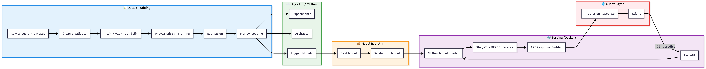

# Thai Sentiment Analysis — MLOps Pipeline
End-to-end MLOps system for Thai text sentiment classification, built on the
**Wisesight Sentiment** dataset. Fine-tunes **PhayaThaiBERT** with full
experiment tracking, a versioned model registry, a typed inference API.

---

## Architecture


## Architecture Overview

| Layer | Components | Responsibility |
|---------|------------|--------------|
| Data Pipeline | Dataset → Cleaning → Split | Prepare training-ready data. |
| Training Pipeline | Training → Evaluation | Train and evaluate the sentiment model. |
| Experiment Tracking | MLflow | Track metrics, parameters, and artifacts. |
| Model Management | Registry → Best Model → Production Model | Version and promote models for deployment. |
| Serving Layer | Model Loader → Inference → Response Builder | Serve predictions using the production model. |
| API Layer | FastAPI | Provide REST endpoints for inference. |
| Client Layer | Client Applications | Consume sentiment prediction services. |

---

## Tech stack

| Layer | Technology |
|---|---|
| Model | PyTorch · HuggingFace Transformers [`clicknext/phayathaibert`](https://huggingface.co/clicknext/phayathaibert)|
| Experiment tracking | MLflow (tracking server + model registry) |
| Orchestration | Prefect |
| Serving | FastAPI · Pydantic v2 · Uvicorn |
| Dependency management | Poetry |
| Containerization | Docker · Docker Compose |
| Hosting (reference deployment) | DagsHub (MLflow) |

---

## Project structure

## Project Structure

```text
(root)
├── api/                          # FastAPI inference service
│   ├── main.py                   # Application entry point
│   ├── predictor.py              # Model loading and prediction logic
│   ├── schemas.py                # Request/response schemas
│   ├── middleware/
│   │   └── logging.py            # Request logging middleware
│   └── routers/
│       ├── health.py             # Health check endpoint
│       └── inference.py          # Prediction endpoint
│
├── assets/
│   └── architecture.png          # System architecture diagram
│
├── config/
│   ├── data.yaml                 # Data pipeline configuration
│   └── train.yaml                # Training configuration
│
├── data/
│   ├── raw/                      # Original Wisesight dataset
│   └── processed/                # Cleaned and split datasets
│
├── docker/
│   └── Dockerfile.api            # API container definition
│
├── notebooks/                    # Research and experimentation notebooks
│   ├── 1_Preprocess_and_EDA.ipynb
│   ├── 2_train_1_tfidf_mlflow.ipynb
│   ├── 2_train_2_phayathaibert_mlflow.ipynb
│   ├── 2_train_3_fasttext_classifier_mlflow.ipynb
│   └── 2_train_4_tfidf_handled_imbalanced_mlflow.ipynb
│                             
│
├── pipelines/
│   ├── data_pipeline.py          # Data preparation pipeline
│   └── training_pipeline.py      # End-to-end training pipeline
│
├── src/
│   ├── data/
│   │   ├── dataset.py            # PyTorch dataset implementation
│   │   ├── loader.py             # Dataset loading utilities
│   │   └── preprocessor.py       # Text preprocessing pipeline
│   │
│   ├── mlflow/
│   │   ├── mlflow_registry.py    # MLflow logging and registry utilities
│   │   └── promote_model.py      # Model promotion workflow
│   │
│   ├── models/
│   │   └── classifier.py         # PhayaThaiBERT classifier definition
│   │
│   ├── training/
│   │   ├── trainer.py            # Training loop implementation
│   │   ├── training.py           # Training orchestration
│   │   └── evaluator.py          # Evaluation metrics and reporting
│   │
│   └── utils/
│       └── load_config.py        # Configuration loader
│
├── tests/
│   ├── smoke_test.py             # End-to-end pipeline validation
│   └── mlflow_test.py            # MLflow integration tests
│
├── docker-compose.yml            # Local service orchestration
├── pyproject.toml                # Poetry dependencies and project config
├── poetry.lock                   # Locked dependency versions
├── README.md                     # Project documentation
└── mlflow.db                     # Local MLflow tracking database
```

---

## Dataset & label schema

[**Wisesight Sentiment**](https://huggingface.co/datasets/pythainlp/wisesight_sentiment)
is a Thai social-media sentiment corpus collected from multiple platforms and
labelled into four classes:

| `label_id` | `label_name` | Meaning |
|---|---|---|
| 0 | `neg` | Negative sentiment |
| 1 | `neu` | Neutral statement |
| 2 | `pos` | Positive sentiment |
| 3 | `q` | Question (no sentiment) |

Text is cleaned before training (`src/data/preprocessor.py`): Thai character
normalization, URL removal, @mention stripping, masked phone-number removal,
whitespace collapsing, and deduplication.

---

## Getting started

### Prerequisites
- Python 3.10 – 3.14 (not 3.14.1)
- [Poetry](https://python-poetry.org/)
- [Docker](https://docs.docker.com/get-docker/) & [Docker Compose](https://docs.docker.com/compose/)
- [Git](https://git-scm.com/)
- A [HuggingFace](https://huggingface.co/settings/tokens) access token (for downloading PhayaThaiBERT)

### Installation

1. Clone the repo
2. Install dependencies via Poetry (poetry install)
3. Set up environment variables (HuggingFace token, MLflow URI)
4. Start services with Docker Compose

### Quick smoke test

Validates the entire pipeline end-to-end using small model — useful
before committing to a full training run.

```bash
python scripts/smoke_test.py
```

---

## Running the pipelines

### 1. Data pipeline

Downloads Wisesight Sentiment from HuggingFace and produces cleaned CSV splits.

```bash
python pipelines/data_pipeline.py
```

All hyperparameters are read from `configs/data.yaml`

### 2. Training pipeline

```bash
# Full Prefect flow: validate data → train → register → promote to Production
python pipelines/training_pipeline.py
```

All hyperparameters are read from `configs/train.yaml`

### 3. Serve the model

```bash
uvicorn api.main:app --reload --port 8000
```

Visit `http://localhost:8000/docs` for the interactive Swagger UI.


## API reference

| Method | Endpoint | Description |
|---|---|---|
| `POST` | `/predict` | Classify a single Thai text |
| `POST` | `/predict/batch` | Classify up to 100 texts in one call |
| `GET` | `/health` | Liveness check — is the process running? |
| `GET` | `/ready` | Readiness check — is the model loaded? |
| `GET` | `/docs` | Interactive Swagger UI |

**Example request:**

```bash
curl -X POST http://localhost:8000/predict \
  -H "Content-Type: application/json" \
  -d '{"text": "อาหารอร่อยมากเลยครับ"}'
```

**Example response:**

```json
{
  "label": "neg",
  "confidence": 0.9924018383026123
}
```

---

## Running with Docker

```bash
docker-compose up --build   # starts MLflow + FastAPI together
```

| Service | URL |
|---|---|
| MLflow tracking UI | http://localhost:5000 |
| FastAPI service | http://localhost:8000 |
| Swagger UI | http://localhost:8000/docs |

```bash
docker-compose logs -f api   # watch the API load the model
docker-compose down -v       # stop and wipe all data
```

---

## MLOps features

- [x] Config-driven training — every hyperparameter lives in `configs/train.yaml`
- [x] MLflow experiment tracking — params, metrics, confusion matrix, model artifacts
- [x] MLflow Model Registry — `Staging` → `Production` with automatic archiving
- [x] FastAPI inference service with Pydantic request/response validation
- [x] Prefect orchestration — retryable, cacheable, observable pipeline runs
- [x] Docker Compose multi-service deployment
- [x] CI pipeline on GitHub Actions

---

## Results

| Model | Accuracy | F1 (macro) | F1 (weighted) |
|---|---|---|---|
| PhayaThaiBERT (fine-tuned) | `0.76` | `0.66` | `0.76` |
| FastText | `0.70` | `0.57` | `0.69` |
| TF-IDF + SVM | `0.68` | `0.53` | `0.66` |
| TF-IDF + XGBoost | `0.68` | `0.51` | `0.66` |
| TF-IDF + Logistic Regression | `0.68` | `0.47` | `0.65` |
| TF-IDF + SVM (Class Balanced) | `0.66` | `0.54` | `0.66` |
| TF-IDF + Logistic Regression (Class Balanced) | `0.63` | `0.54` | `0.64` |
| TF-IDF + XGBoost (Class Balanced) | `0.62` | `0.53` | `0.63` |
---
